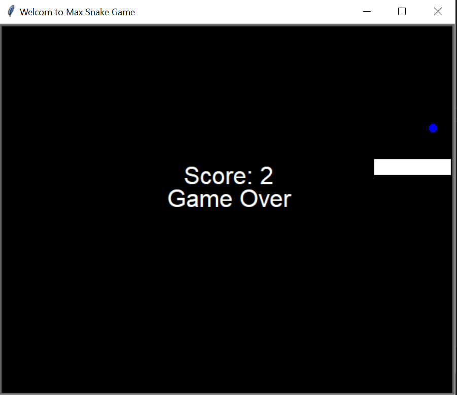

# 🐍 Max Snake Game  

A classic **Snake Game** built using Python's `turtle` module. Control the snake, eat food, and grow while avoiding collisions! 🎮 

## 📌 Features  
✅ Smooth movement with arrow keys (⬆️⬇️➡️⬅️)  
✅ Score tracking system 🏆 
✅ Random food spawning 🍏  
✅ Collision detection with walls & itself 🚧  
✅ Simple & clean UI  

## 🚀 How to Play  
1. Run the game using Python.  
2. Use the **arrow keys** to control the snake.  
3. Eat food to grow and increase your score.  
4. Avoid hitting the walls or yourself—**game over** if you do!  

## 🛠 Installation & Setup  
1. Clone the repository:  
   ```sh
   git clone https://github.com/dani6566/Max_snake_game.git
   cd Max_snake_game
## 📂 project structure
max-snake-game/
│── Scripts/
│   ├── snake.py
│   ├── food.py
│   ├── scoreboard.py
│── main.py
│── README.md


## 📸 screenshot image
.

